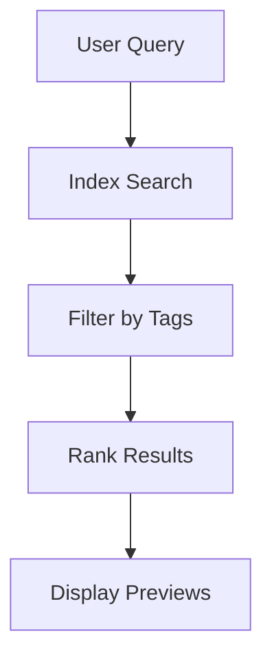

## Overview

Lawnstarter provides powerful tools to create, manage, and collaborate on your documentation. You can build structured content with an intuitive editor, track changes over time, find information quickly, and control access for your team.

<Callout kind="info">
  Start by exploring these core features to streamline your documentation workflow.
</Callout>

## Document Creation and Editing Tools

Create new documents directly in Lawnstarter using the visual editor or markdown mode. You get real-time previews, rich text formatting, and support for embedded components.

<Steps>
  <Step title="Create a New Document" icon="file-plus">
    Navigate to your workspace and select `New Document`.

    ```bash
    curl -X POST https://api.example.com/v1/documents \
      -H "Authorization: Bearer YOUR_API_KEY" \
      -d '{"title": "My Guide", "content": "# Hello World"}'
    ```
  </Step>
  <Step title="Edit Content" icon="edit-3">
    Use the editor toolbar for headings, lists, and code blocks. Switch to markdown for advanced formatting.
  </Step>
  <Step title="Preview and Publish" icon="eye">
    Preview changes live, then publish to make your document available.
  </Step>
</Steps>

<CodeGroup tabs="Visual Editor,Markdown">
  ```markdown
  ## Heading

  - List item
  - Another item

  `Inline code`
  ```
  ```html
  <h2>Heading</h2>
  <ul>
    <li>List item</li>
    <li>Another item</li>
  </ul>
  <code>Inline code</code>
  ```
</CodeGroup>

## Version Control and History Tracking

Lawnstarter automatically saves versions of your documents. You can view history, compare changes, and revert to previous versions easily.

<Tabs>
  <Tab title="View History" icon="clock">
    Open any document and click the history icon to see all versions.

    <Image
      src="https://via.placeholder.com/800x400/1F883D/ffffff?text=Version+History"
      alt="Version history panel showing changes over time"
      width="800"
      height="400"
    />
  </Tab>
  <Tab title="Compare Changes" icon="git-compare">
    Select two versions to see a side-by-side diff.

    ```diff
    + Added new feature description
    - Removed outdated instructions
      Unchanged paragraph here.
    ```
  </Tab>
  <Tab title="Revert Version" icon="refresh-cw">
    Choose a version and click `Restore` to revert.
  </Tab>
</Tabs>

## Search and Organization Features

Find documents quickly with full-text search across your workspace. Organize content using tags, folders, and custom categories.

<Columns cols={2}>
  <Card title="Global Search" icon="search" href="#search-tips">
    Search by keywords, titles, or tags. Results include previews.
  </Card>
  <Card title="Smart Folders" icon="folder" href="#organization">
    Auto-organize documents based on rules like tags or dates.
  </Card>
</Columns>

<Expandable title="Advanced Search Tips" default-open="true">
  Use operators like `tag:api` or `from:2024` to refine results. Combine with filters for precise matches.
</Expandable>



## Team Permissions and Sharing Options

Control who can view, edit, or publish documents with granular permissions. Share publicly or invite team members via email or links.

| Permission Level | View | Edit | Publish | Admin |
|------------------|------|------|---------|-------|
| Viewer           | ✅   | ❌   | ❌      | ❌    |
| Editor           | ✅   | ✅   | ❌      | ❌    |
| Publisher        | ✅   | ✅   | ✅      | ❌    |
| Admin            | ✅   | ✅   | ✅      | ✅    |

<Callout kind="tip" title="Best Practices">
  Assign the minimum permissions needed. Use workspace-level settings for broad controls and document-level for specifics.
</Callout>

<ParamField path="teamId" param-type="string" required="true">
  Your team's unique identifier for permission checks.
</ParamField>

<ParamField header="Authorization" param-type="string" required="true">
  Bearer token with scopes for read/write access.
</ParamField>

## Next Steps

<Columns cols={3}>
  <Card title="Quickstart" icon="zap" href="/quickstart">
    Set up your first workspace.
  </Card>
  <Card title="Authentication" icon="shield" href="/authentication">
    Secure your API access.
  </Card>
  <Card title="API Reference" icon="code" href="/api">
    Integrate programmatically.
  </Card>
</Columns>