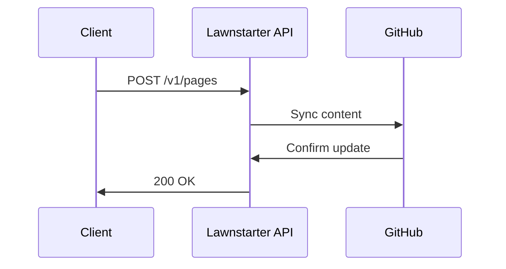

## Overview

Lawnstarter supports seamless integrations with popular tools to streamline your documentation processes. You can sync content with GitHub for version control, set up webhooks for real-time automation, embed external content, and build custom extensions using the API. These features enable you to create a connected workflow tailored to your needs.

<Callout kind="tip">
Start with GitHub integration for automatic documentation updates from your repository.
</Callout>

## Key Integrations

Use these built-in integrations to extend Lawnstarter's capabilities.

<Columns cols={2}>
  <Card title="GitHub" icon="github" href="https://github.com/lawnstarter/brain">
    Sync repositories directly. Changes in your repo automatically update documentation pages.
  </Card>
  <Card title="Webhooks" icon="zap" href="#webhook-setup">
    Receive real-time notifications for events like page updates or new versions.
  </Card>
  <Card title="API Extensions" icon="code" href="#api-access">
    Build custom tools with full API access.
  </Card>
  <Card title="Embeds" icon="external-link" href="#embedding-content">
    Embed tools like Figma designs or live demos effortlessly.
  </Card>
</Columns>

## GitHub and Version Control

Connect your GitHub repository to Lawnstarter to keep documentation in sync with code changes. You push updates to your repo, and Lawnstarter pulls the latest markdown files.

### Setup Steps

<Steps>
  <Step title="Connect Repository" icon="github">
    Navigate to Settings > Integrations in your Lawnstarter dashboard. Authorize GitHub and select your repo.
  </Step>
  <Step title="Configure Sync" icon="settings">
    Choose branches to watch (e.g., `main`, `develop`) and file paths (e.g., `docs/**/*.mdx`).
  </Step>
  <Step title="Test Sync" icon="play">
    Push a test commit and verify the documentation updates.
  </Step>
</Steps>

<CodeGroup tabs="JavaScript,Python">
  ```javascript
  // Example GitHub webhook handler for Lawnstarter
  app.post('/webhook/lawnstarter', (req, res) => {
    if (req.body.ref === 'refs/heads/main') {
      updateDocs(req.body.repository.html_url);
    }
    res.status(200).send('OK');
  });
  ```
  ```python
  # Example GitHub webhook handler
  from flask import Flask, request

  app = Flask(__name__)

  @app.route('/webhook/lawnstarter', methods=['POST'])
  def webhook():
      if request.json['ref'] == 'refs/heads/main':
          update_docs(request.json['repository']['html_url'])
      return 'OK', 200
  ```
</CodeGroup>

## Webhook Setup for Automation

Webhooks allow external services to trigger actions in Lawnstarter, such as deploying updates on CI/CD completion.

### Webhook Parameters

<ParamField path="event" param-type="string" required="true">
  The triggering event, e.g., `page.updated` or `version.released`.
</ParamField>

<ParamField header="X-Lawnstarter-Signature" param-type="string" required="true">
  HMAC signature for verification using your webhook secret.
</ParamField>

<ParamField body="payload" param-type="object" required="false">
  Custom data payload for the event.
</ParamField>

### Configuration Steps

<Tabs>
  <Tab title="Dashboard" icon="settings">
    <Steps>
      <Step title="Generate URL">
        In Lawnstarter Settings > Webhooks, create a new webhook and copy the endpoint URL.
      </Step>
      <Step title="Add Secret">
        Generate a secret key and configure it for signature verification.
      </Step>
    </Steps>
  </Tab>
  <Tab title="GitHub" icon="github">
    ```bash
    # Add webhook via GitHub CLI
    gh api repos/:owner/:repo/hooks \
      --method POST \
      --field url=https://api.example.com/webhooks/lawnstarter \
      --field content_type=application/json
    ```
  </Tab>
</Tabs>

## Embedding External Content

Embed iframes or components from third-party tools directly into your Lawnstarter pages.

<Expandable title="Supported Providers" default-open="true">
  - Figma: Use `https://www.figma.com/embed?embed_host=docs.lawnstarter.com&url=...`
  - YouTube: Standard embed URLs
  - Google Forms: For feedback collection
  - Custom iframes with `sandbox` attributes for security
</Expandable>

Example embed code:

````jsx
<Iframe
  src="https://www.figma.com/embed?embed_host=docs.lawnstarter.com&url=https://www.figma.com/file/ABC123"
  title="Design Prototype"
  width="100%"
  height="600"
/>
````

## API Access for Custom Extensions

Access Lawnstarter's API at `https://api.example.com/v1` to build custom integrations.

<ResponseField name="data" field-type="object" required="true">
  Response payload containing documentation resources.
</ResponseField>

<ResponseField name="pages" field-type="array" required="false">
  List of published pages with metadata.
</ResponseField>

<Callout kind="alert">
Always use HTTPS and authenticate requests with `Authorization: Bearer YOUR_API_KEY`.
</Callout>



These integrations make Lawnstarter a flexible hub for your documentation ecosystem. Explore the [Quickstart](/quickstart) for initial setup, then customize based on your workflow.